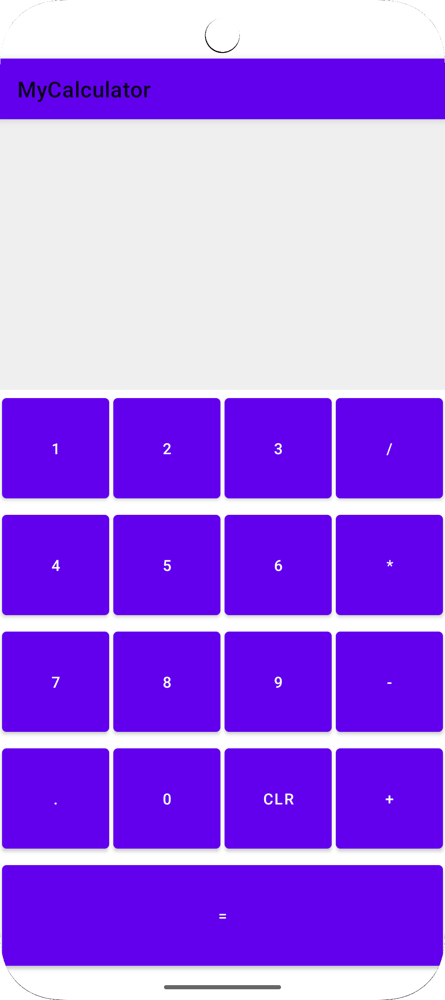
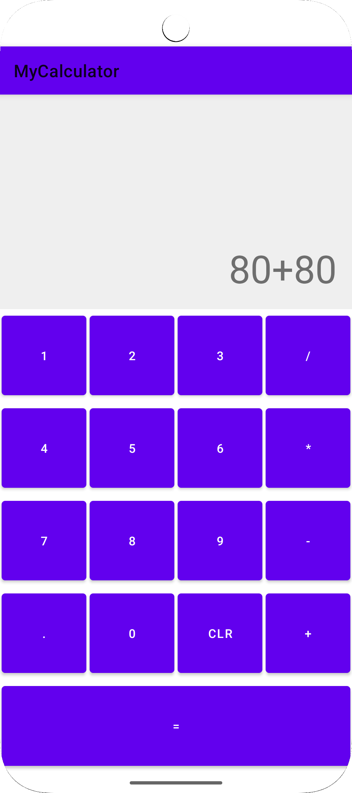
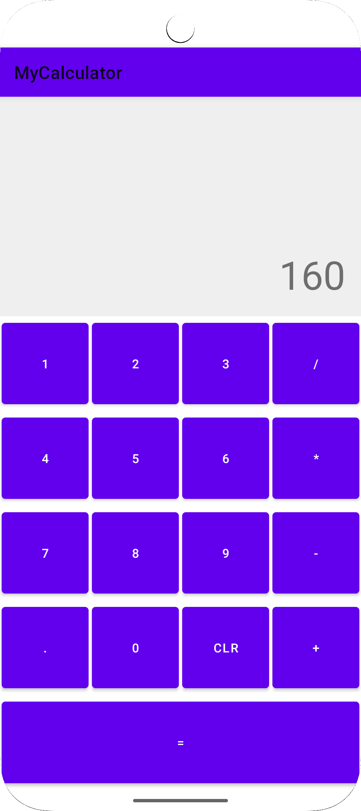
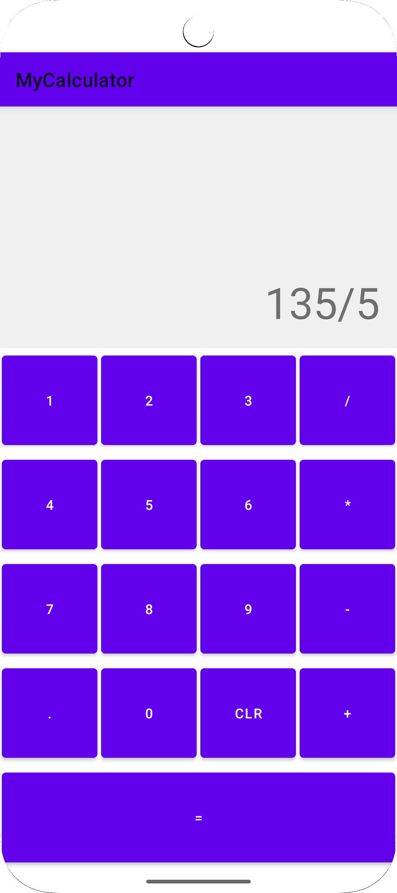

# My Calculator App (Kotlin)

A **Kotlin-based Android Calculator App** providing a clean, intuitive interface for performing basic arithmetic operations seamlessly on Android devices.

## Features

✅ Perform addition, subtraction, multiplication, and division  
✅ Clear and responsive user interface  
✅ Error handling for invalid operations (e.g., division by zero)  
✅ Supports decimal operations  
✅ Lightweight, fast, and battery-friendly  
✅ Built using clean MVVM Kotlin structure for learning and scalability

## Screenshots

  
 

## Tech Stack

- Kotlin
- Android SDK
- ConstraintLayout
- MVVM (optional based on your implementation)

## Getting Started

1️⃣ **Clone the repository:**

```bash
git clone https://github.com/yourusername/MyCalculatorApp-Kotlin.git